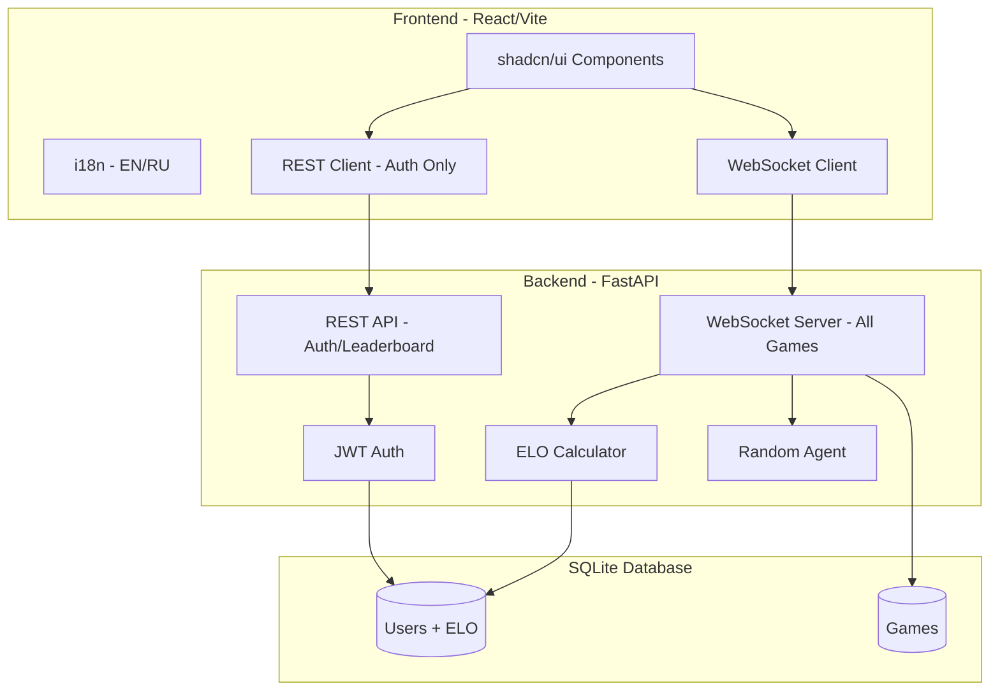

# Ugolki Web Game Architecture

A full-stack web application for playing Ugolki (Russian Corners) with React frontend, FastAPI backend, SQLite database, supporting vs-AI mode, real-time two-player multiplayer via WebSockets, ELO rankings, and English/Russian language toggle.

## System Overview



## Project Structure

```
russian-rl/
├── frontend/                 # React application
│   ├── src/
│   │   ├── components/       # UI components (GameBoard, Header, ui/)
│   │   ├── pages/            # Login, Signup, Lobby, Game, Leaderboard
│   │   ├── lib/              # API client, auth context, utilities
│   │   ├── hooks/            # Custom React hooks (useGameSocket)
│   │   └── i18n/             # Internationalization (en.json, ru.json)
│   └── ...
├── backend/                  # FastAPI server
│   ├── api/                  # Route handlers (auth, leaderboard, websocket)
│   ├── models/               # SQLAlchemy models (database.py)
│   ├── services/             # Business logic (auth, elo)
│   └── main.py               # Application entry point
├── games/                    # Game logic
│   ├── base.py               # Base game class
│   └── ugolki.py             # Ugolki game implementation
├── agents/                   # AI agents
│   ├── base.py               # Base agent class
│   └── random_agent.py       # Random move selection agent
└── tests/                    # Test suite
```

## Backend Architecture

### Technology Stack

- **Framework**: FastAPI
- **Database**: SQLite with SQLAlchemy ORM
- **Authentication**: JWT tokens with bcrypt password hashing
- **Real-time Communication**: WebSockets

### Database Models

#### User
| Field | Type | Description |
|-------|------|-------------|
| id | Integer | Primary key |
| username | String | Unique username |
| email | String | Unique email address |
| password_hash | String | Bcrypt hashed password |
| elo | Integer | ELO rating (default: 1200) |
| created_at | DateTime | Account creation timestamp |

#### Game
| Field | Type | Description |
|-------|------|-------------|
| id | String | UUID primary key |
| player1_id | Integer | Foreign key to User |
| player2_id | Integer | Foreign key to User (nullable for AI) |
| game_type | String | "ai" or "pvp" |
| status | String | "waiting", "active", "completed" |
| winner_id | Integer | Foreign key to User (nullable) |
| board_state | JSON | Serialized game state |
| created_at | DateTime | Game creation timestamp |

### REST API Endpoints

| Endpoint | Method | Description |
|----------|--------|-------------|
| `/auth/signup` | POST | Register new user |
| `/auth/login` | POST | Authenticate and receive JWT |
| `/auth/me` | GET | Get current user profile |
| `/leaderboard` | GET | Get ELO rankings |

### WebSocket Protocol

**Endpoint**: `/ws/game/{game_id}`

The WebSocket server handles all game communication for both vs-AI and vs-Player modes with a unified protocol.

#### Client → Server Messages

| Type | Payload | Description |
|------|---------|-------------|
| `create_game` | `{ type: "ai" \| "pvp" }` | Create a new game |
| `join` | `{}` | Join an existing game |
| `move` | `{ from: [r, c], to: [r, c] }` | Make a move |

#### Server → Client Messages

| Type | Payload | Description |
|------|---------|-------------|
| `game_state` | `{ board, turn, legal_moves, ... }` | Current game state |
| `game_over` | `{ winner, elo_changes }` | Game ended |
| `opponent_disconnected` | `{}` | Opponent left the game |
| `error` | `{ message }` | Error occurred |

### ELO Calculation

Standard chess ELO system with K-factor of 32:

```python
K = 32
expected = 1 / (1 + 10 ** ((opponent_elo - player_elo) / 400))
new_elo = old_elo + K * (actual_score - expected)
# actual_score: 1 = win, 0 = loss, 0.5 = draw
```

## Frontend Architecture

### Technology Stack

- **Framework**: React 18 with TypeScript
- **Build Tool**: Vite
- **Styling**: Tailwind CSS
- **UI Components**: shadcn/ui
- **Routing**: React Router DOM
- **Internationalization**: react-i18next
- **HTTP Client**: Axios (for REST) + native WebSocket

### Pages

| Page | Route | Description |
|------|-------|-------------|
| Login | `/login` | User authentication form |
| Signup | `/signup` | New user registration |
| Lobby | `/lobby` | Create/join games, game listing |
| Game | `/game/:id` | Interactive game board |
| Leaderboard | `/leaderboard` | Player rankings by ELO |

### Key Components

#### GameBoard
- Renders 8×8 grid with pieces
- Click to select piece, highlights legal moves
- Click destination to execute move
- Shows turn indicator and game status

#### Header
- Navigation links
- Language toggle (EN/RU)
- User info and logout

### Design System

- **Color Palette**: Slate grays, warm amber accents, clean whites
- **Typography**: Modern sans-serif (system fonts via Tailwind)
- **Aesthetic**: Clean, minimal design focused on gameplay clarity

## Game Flow

### vs AI Mode

```
┌─────────┐     create_game(type="ai")      ┌─────────┐
│  User   │ ──────────────────────────────► │ Server  │
│         │                                  │         │
│         │ ◄────────── game_state ───────── │         │
│         │                                  │         │
│         │ ─────────── move ──────────────► │         │
│         │                                  │  ┌───┐  │
│         │                                  │  │ AI│  │
│         │                                  │  └───┘  │
│         │ ◄────────── game_state ───────── │         │
│         │     (includes AI response)       │         │
│         │                                  │         │
│         │ ◄────────── game_over ────────── │         │
└─────────┘                                  └─────────┘
```

1. User connects to WebSocket, sends `create_game` with type="ai"
2. Server creates game, initializes board, sends `game_state`
3. User sends `move`, server validates and applies
4. Server automatically generates AI response move
5. Server sends updated `game_state` after each move pair
6. On win condition, server sends `game_over` and updates ELO

### Two-Player (PvP) Mode

```
┌──────────┐                              ┌──────────┐
│ Player 1 │   create_game(type="pvp")    │  Server  │
│          │ ────────────────────────────►│          │
│          │ ◄─── game_state (waiting) ───│          │
│          │                              │          │
│          │                              │          │◄─── join ────┌──────────┐
│          │                              │          │              │ Player 2 │
│          │ ◄────── game_state ──────────│          │──────────────│          │
│          │                              │          │  game_state ►│          │
│          │                              │          │              │          │
│          │ ──────── move ──────────────►│          │              │          │
│          │ ◄────── game_state ──────────│          │──────────────│          │
│          │                              │          │  game_state ►│          │
│          │                              │          │              │          │
│          │                              │          │◄─── move ────│          │
│          │ ◄────── game_state ──────────│          │──────────────│          │
│          │                              │          │  game_state ►│          │
│          │                              │          │              │          │
│          │ ◄────── game_over ───────────│          │──────────────│          │
└──────────┘                              └──────────┘  game_over ► └──────────┘
```

1. Player 1 connects to WebSocket, sends `create_game` with type="pvp"
2. Server creates game, sends game_id, Player 1 waits
3. Player 2 connects with game_id, sends `join`
4. Both players receive `game_state`, game begins
5. Moves sent via WebSocket, server validates and broadcasts to both
6. On game end, server sends `game_over` and updates ELO for both players

## Dependencies

### Backend (`pyproject.toml`)

```toml
dependencies = [
    "fastapi",
    "uvicorn",
    "sqlalchemy",
    "python-jose[cryptography]",
    "passlib[bcrypt]",
    "websockets",
]
```

### Frontend (`package.json`)

```json
{
  "dependencies": {
    "react": "^18.x",
    "react-dom": "^18.x",
    "react-router-dom": "^6.x",
    "react-i18next": "^13.x",
    "i18next": "^23.x",
    "axios": "^1.x",
    "@radix-ui/react-*": "...",
    "tailwindcss": "^3.x",
    "class-variance-authority": "...",
    "clsx": "...",
    "tailwind-merge": "..."
  }
}
```

## Running the Application

### Backend

```bash
# Start the FastAPI server
uv run uvicorn backend.main:app --reload --port 8000
```

### Frontend

```bash
cd frontend
npm install
npm run dev
```

The frontend development server runs on `http://localhost:5173` and proxies API requests to the backend on `http://localhost:8000`.
